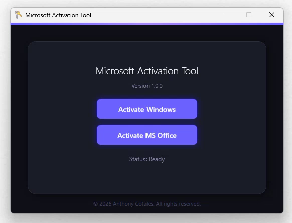

#  Microsoft Activation Tool (MAT)

A simple application to activate Microsoft Windows and Microsoft Office licenses. The tool provides a clean interface with buttons to trigger activation tasks and displays status updates upon completion.

## 📸 Screenshot

  

## 🌟 Features

- One-click activation for Windows and MS Office.
- Displays real-time status messages.
- Lightweight and easy to run on Windows.
- Utilizes modern activation methods.

## 🛠️ Requirements

- Windows 10 or 11
- Microsoft 365 or Office 2021+
- Internet connection (for initial activation)

## 🚀 How to Use

- **Download** the latest release version [here](https://github.com/acotales/MAT/releases/latest/download/MAT.exe).

- **Unblock the File**:
   - Right-click the downloaded `.exe` file.
   - Select **Properties**.
   - Under the **General** tab, check the **Unblock** box at the bottom.
   - Click **OK**.

- **Run the App**

## ⚠️ Disclaimer

This tool is for **educational purposes only**. The author does not condone or encourage the use of this tool to bypass legitimate software licensing. Please support software developers by purchasing genuine licenses from Microsoft. Use this tool at your own risk.

## 📜 License

Distributed under the MIT License. See `LICENSE` for more information.
